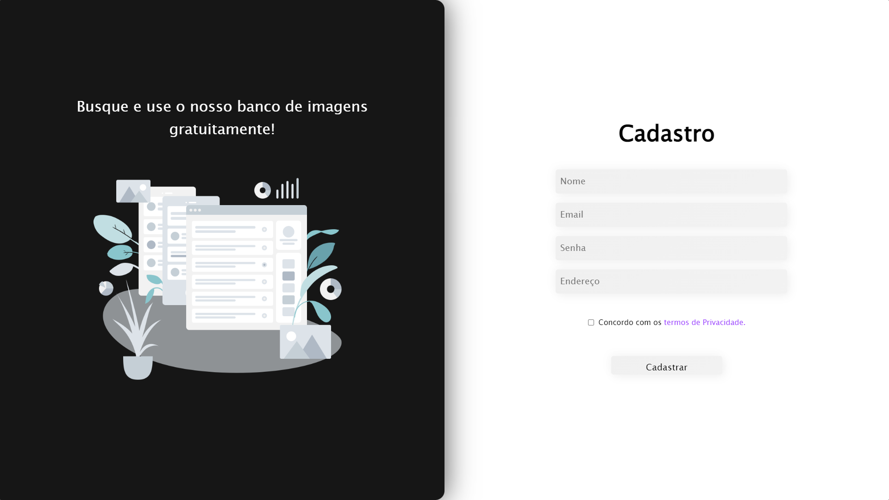

# Sign up page

Aqui está um projeto de uma página de cadastro simples que fiz com o objetivo de treinar o posicionamento de divs e alguns inputs de formulários, o projeto já está adaptado à responsividade de dispositivos móveis e desktops.

Podem acessar o projeto no Github Pages através do link abaixo:

<a href="https://nathan-fontenele.github.io/Sign-up-page/">Sign up page</a>

## Captura de tela

